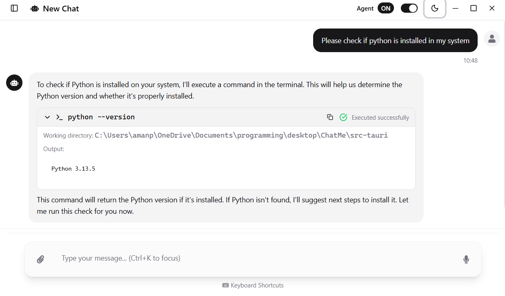

# ChatMe 🤖

A modern, cross-platform A### 🎨 **Modern Interface**
- **Custom Title Bar**: Integrated window controls with drag functionality (desktop)
- **Responsive Design**: Mobile-friendly UI that adapts to different screen sizes
- **Dark/Light Theme**: System-aware theme switching
- **Sidebar Navigation**: Easy chat management and organization
- **Smooth Animations**: Polished user experience with transitions

### 📱 **Responsive Features**
- **Touch-Friendly Controls**: Large tap targets for accessibility
- **Adaptive Layout**: Auto-resizing sidebar and components for different screen sizes
- **Image Upload**: File selection with drag-and-drop and preview functionality
- **Mobile-Optimized**: UI components that work well on tablets and small screens
- **Gesture Support**: Smooth scrolling and intuitive interactionsion built with Tauri, React, and TypeScript. ChatMe supports multiple AI providers with a beautiful, responsive interface and advanced features.

## 🌟 Platform Support

- **🖥️ Desktop**: Windows, macOS, Linux
- **🌐 Web**: Progressive Web App capabilities
- **📱 Mobile**: UI is responsive and mobile-friendly (native mobile apps coming soon)

## 📸 Screenshots

<div align="center">
  <table>
    <tr>
      <td align="center">
        
        <br/>
        <sub><b>Light Theme</b></sub>
      </td>
      <td align="center">
        
        <br/>
        <sub><b>Dark Theme</b></sub>
      </td>
    </tr>
  </table>
</div>

---


## ✨ Features

### 🎯 **Multi-Provider AI Support**
- **OpenAI**: GPT-4, GPT-4 Turbo, GPT-3.5 Turbo and many more
- **Google Gemini**: Gemini Pro, Gemini 1.5 Flash/Pro and many more (both original and OpenAI-compatible APIs)
- **Anthropic Claude**: Claude 3 models
- **Ollama**: Local models (Llama 2, CodeLlama, Mistral, etc.)
- **Custom APIs**: Support for Mistral AI, Groq, Together AI, Perplexity, and any OpenAI-compatible API

### 🎨 **Modern Interface**
- **Custom Title Bar**: Integrated window controls with drag functionality (desktop)
- **Mobile-First Design**: Touch-optimized interface for mobile devices
- **Responsive Layout**: Auto-adapting sidebar and layout for all screen sizes
- **Dark/Light Theme**: System-aware theme switching
- **Sidebar Navigation**: Easy chat management and organization
- **Smooth Animations**: Polished user experience with transitions

### � **Mobile Features**
- **Touch-Optimized Controls**: Minimum 44px touch targets for accessibility
- **Mobile Sidebar**: Auto-collapsing navigation to save screen space
- **Image Upload**: Camera and gallery integration for image uploads
- **Gesture Support**: Smooth scrolling and touch interactions
- **Mobile Keyboard**: Optimized input handling for mobile keyboards
- **Responsive Images**: Properly scaled image previews and displays

### �💬 **Advanced Chat Features**
- **Real-time Streaming**: Live message streaming for supported providers
- **Image Analysis**: Upload and analyze images with AI vision models
- **AI Thinking Display**: Collapsible sections showing AI reasoning process
- **Message Management**: Copy, export, and share conversations
- **Chat History**: Persistent chat storage with SQLite
- **Markdown Support**: Rich text rendering with syntax highlighting
- **Scroll Management**: Intelligent auto-scrolling and manual scroll control

### ⚙️ **Configuration & Settings**
- **Provider Management**: Easy setup and switching between AI providers
- **API Testing**: Built-in connection testing with CORS-aware error handling
- **Model Selection**: Support for different models per provider
- **Parameter Tuning**: Temperature, max tokens, and other settings
- **Default Configurations**: Set preferred providers for new chats

## 🚀 Getting Started

### 📦 Downloads

#### Desktop Applications
- **Windows**: Download `.exe` installer from [Releases](https://github.com/Amanbig/ChatMe/releases)
- **macOS**: Download `.dmg` file (Intel and Apple Silicon supported)
- **Linux**: Download `.deb` package or `.AppImage`

#### Mobile Support
- **Responsive Web UI**: The application works well on mobile browsers
- **Native Mobile Apps**: Coming soon - currently in development

### Prerequisites

- **Node.js** (v18 or higher)
- **Rust** (latest stable)
- **pnpm/npm/yarn** (package manager)

### Installation

1. **Clone the repository**
   ```bash
   git clone https://github.com/Amanbig/ChatMe.git
   cd ChatMe
   ```

2. **Install dependencies**
   ```bash
   npm install
   ```

3. **Start development server**
   ```bash
   npm run dev
   ```

4. **Build for production**
   ```bash
   npm run build
   ```

### 🌐 Testing on Mobile Devices

While native mobile apps are in development, you can test the responsive UI:

1. **Browser dev tools**: Use mobile device simulation
2. **Local network**: Access the dev server from mobile browsers
3. **Responsive testing**: Resize desktop window to test different screen sizes

## 🔧 Configuration

### Setting up AI Providers

1. **Launch ChatMe** and navigate to Settings
2. **Select a Provider** from the available cards
3. **Configure the API**:
   - **API Key**: Your provider's API key
   - **Base URL**: Custom endpoint (optional for most providers)
   - **Model**: Choose from available models
   - **Parameters**: Adjust temperature, max tokens, etc.
4. **Test Connection** to verify setup
5. **Set as Default** (optional)

### Provider-Specific Setup

#### OpenAI
- **URL**: `https://api.openai.com/v1/chat/completions`
- **Models**: `gpt-4`, `gpt-4-turbo`, `gpt-3.5-turbo`

#### Google Gemini
- **OpenAI-Compatible**: `https://generativelanguage.googleapis.com/v1beta/openai/chat/completions`
- **Original API**: `https://generativelanguage.googleapis.com/v1beta`
- **Models**: `gemini-pro`, `gemini-1.5-flash`, `gemini-1.5-pro`

#### Mistral AI (Custom)
- **URL**: `https://api.mistral.ai/v1/chat/completions`
- **Models**: `mistral-large-latest`, `mixtral-8x7b-instruct`

#### Ollama (Local)
- **URL**: `http://localhost:11434`
- **Models**: Any locally installed Ollama model

## 🛠️ Tech Stack

### Frontend
- **Tauri**: Cross-platform desktop framework
- **React 18**: Modern React with hooks
- **TypeScript**: Type-safe development
- **Vite**: Lightning-fast build tool
- **shadcn/ui**: Modern component library
- **Tailwind CSS**: Utility-first styling
- **React Router**: Client-side routing
- **Sonner**: Toast notifications

### Backend
- **Rust**: High-performance backend
- **SQLite**: Local database storage
- **Reqwest**: HTTP client for API calls
- **Serde**: JSON serialization
- **Tokio**: Async runtime

### Features
- **Real-time Events**: Tauri event system
- **Streaming Support**: Server-sent events simulation
- **Error Handling**: Comprehensive error management
- **Theme System**: Dark/light mode switching

## 📁 Project Structure

```
ChatMe/
├── src/                    # Frontend React code
│   ├── components/         # Reusable UI components
│   │   ├── ui/            # shadcn/ui components
│   │   └── app/           # Application-specific components
│   ├── pages/             # Page components
│   ├── lib/               # Utilities and API client
│   └── assets/            # Static assets
├── src-tauri/             # Rust backend
│   ├── src/               # Rust source code
│   │   ├── commands.rs    # Tauri commands
│   │   ├── database.rs    # Database operations
│   │   └── models.rs      # Data models
│   └── Cargo.toml         # Rust dependencies
├── public/                # Public assets
└── package.json           # Node.js dependencies
```

## 🚀 Building & Distribution

### Development
```bash
npm run dev          # Start dev server
npm run build        # Build frontend
cargo tauri dev      # Run Tauri development
```

### Production
```bash
npm run build               # Build frontend
cargo tauri build          # Build desktop app
cargo tauri build --debug  # Build with debug info
```

### Platform Support
- **Windows**: Native .exe and .msi installers
- **macOS**: .app bundle and .dmg installer (Intel and Apple Silicon)
- **Linux**: .deb, .rpm, and AppImage formats
- **Cross-platform**: Responsive UI that works on various screen sizes

## 🤝 Contributing

We welcome contributions! Please follow these steps:

1. **Fork the repository**
2. **Create a feature branch**: `git checkout -b feature/amazing-feature`
3. **Commit changes**: `git commit -m 'Add amazing feature'`
4. **Push to branch**: `git push origin feature/amazing-feature`
5. **Open a Pull Request**

### Development Guidelines
- Use TypeScript for type safety
- Follow the existing code style
- Add tests for new features
- Update documentation as needed

## 📄 License

This project is licensed under the MIT License - see the [LICENSE](LICENSE) file for details.

## 🙏 Acknowledgments

- **Tauri Team**: For the amazing desktop framework
- **shadcn**: For the beautiful UI components
- **Vercel**: For the inspiration and design patterns
- **OpenAI, Anthropic, Google**: For providing excellent AI APIs

## 📞 Support

- **Issues**: [GitHub Issues](https://github.com/Amanbig/ChatMe/issues)
- **Discussions**: [GitHub Discussions](https://github.com/Amanbig/ChatMe/discussions)
- **Email**: [amanpreetsinghjhiwant7@gmail.com](mailto:amanpreetsinghjhiwant7@gmail.com)

---

Made with ❤️ by [Amanbig](https://github.com/Amanbig)
